# AI Agent Patterns — Fundamentals to Advanced

> Covers every major agent execution pattern, framework architectures (LangGraph, AutoGen, CrewAI),
> production state management, and how patterns appear in real projects.

---

## Part 0 — Graph Fundamentals

A **graph** is a data structure made of two things:

- **Nodes** (vertices) — the things
- **Edges** — the connections between things

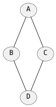

### Types of Graphs

**Directed graph** — edges have a direction. "A calls B" is not the same as "B calls A."

```plantuml
@startuml directed
skinparam monochrome true
skinparam defaultFontName Monospaced

(A) --> (B)
(B) --> (C)
(C) --> (D)

@enduml
```

**DAG (Directed Acyclic Graph)** — directed, no cycles. Used for pipelines where execution
never goes back.

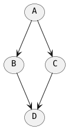

**Cyclic directed graph** — has loops. Used in agent frameworks where the agent loops until
a condition is met (e.g. ReAct tool loop).

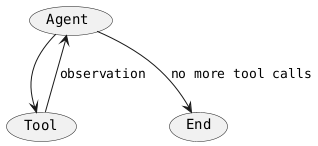

### Why Graphs for Agents?

An agent workflow maps naturally onto a graph:

| Graph Concept     | Agent Equivalent                          |
|-------------------|-------------------------------------------|
| Node              | Unit of work (LLM call, tool, router)     |
| Directed edge     | "After this, run that"                    |
| Conditional edge  | "Go left if X, go right if Y"             |
| Cycle             | "Keep looping until condition is met"     |
| DAG               | Linear pipeline, no re-execution          |

Before graph-based frameworks, agent control flow was hidden inside LLM prompts or tangled
`if/else` chains. Representing it as an explicit graph makes execution **visible, testable,
and modifiable** without touching the LLM logic. The graph is the **map of execution**.

---

### State Machines

A state machine is a system that can be in **exactly one state at a time**, with defined rules
for transitioning between states.

- **States** — a finite set of conditions the system can be in
- **Transitions** — events or conditions that move the system from one state to another
- **Current state** — the state the system is in right now

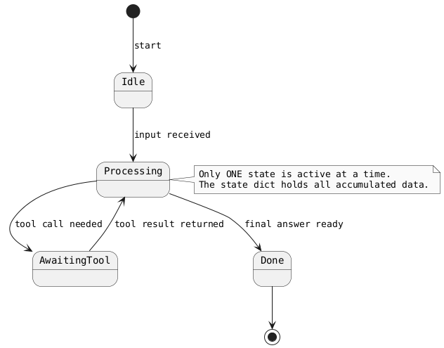

LangGraph is a state machine runtime. Nodes are states, edges are transitions, and the typed
state dict is the current state — carrying all accumulated data. The checkpointer snapshots
the current state after every transition so execution can be resumed or rewound.

---

### MapReduce — Fan-Out and Fan-In

MapReduce is a programming model for processing work in parallel, introduced by Google in 2004.
It has two phases:

- **Map** — split the input into independent chunks and process each in parallel (fan-out)
- **Reduce** — collect all partial results and merge them into a single output (fan-in)

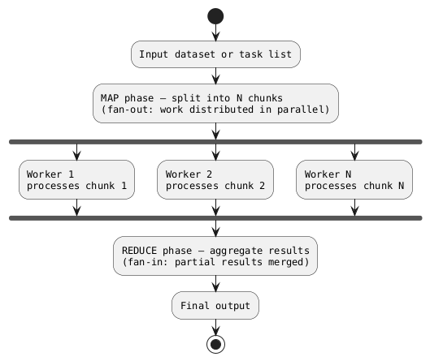

In agent frameworks this appears whenever you have independent work items that can run
concurrently — document chunks, search queries, code files. LangGraph implements it via the
Send API. Wall-clock time is bounded by the **slowest worker**, not the sum of all workers.

---

### Vector Embeddings and Vector Databases

An **embedding** is a list of numbers (a vector) representing the meaning of a piece of text.
The key property: text with similar meaning produces vectors that point in similar directions
in high-dimensional space. Similarity is measured with **cosine similarity**.

A **vector database** stores these vectors and answers: "Given this query vector, which stored
vectors are most similar?" This is semantic search — finds relevant content even when the exact
words don't match.

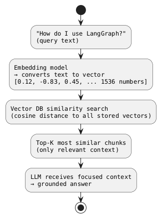

| Term | What it means |
|---|---|
| Embedding | A vector (list of numbers) representing the meaning of text |
| Cosine similarity | How similar two vectors are — 1.0 = identical direction, 0 = unrelated |
| Vector DB | Database optimised for nearest-neighbour search (ChromaDB, Pinecone, pgvector) |
| Top-K | The K most similar chunks returned — typically 3–5 |
| RAG | Retrieval-Augmented Generation — fetch relevant chunks, inject into prompt |

This is the foundation of RAG and every memory-augmented agent — inject only relevant chunks
into the prompt rather than the entire knowledge base, keeping context windows focused and
token costs low.

---

## Part 1 — Foundational Agent Patterns

### 1. REPL (Read-Eval-Print Loop)

The simplest pattern. No memory, no tool use, no planning — just a chatbot loop.

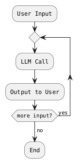

---

### 2. ReAct (Reasoning + Acting)

The dominant pattern for tool-using agents. The LLM alternates between **Thought**, **Action**,
and **Observation** in a scratchpad loop until it reaches a final answer.

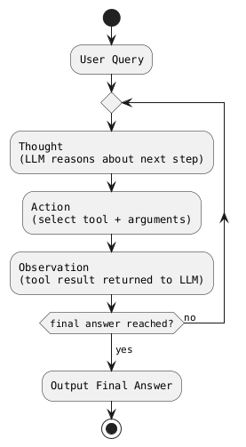

Key property: reasoning and acting are **interleaved**. The observation feeds back into the
next thought, grounding the LLM in real results.

---

### 3. Plan-and-Execute (Two-Stage)

Separates planning from execution. A planner LLM generates a step-by-step plan upfront;
an executor agent runs each step.

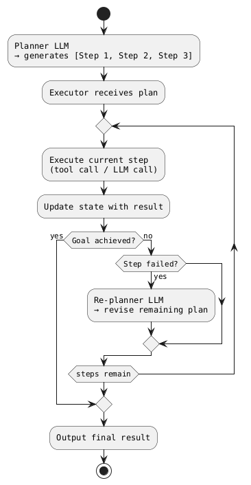

Better for long-horizon tasks. Re-planning on failure is the key differentiator from ReAct.

---

### 4. Reflection / Self-Critique

The agent generates output, then a second LLM call critiques it, and the agent revises.
Loops until a quality gate is passed.

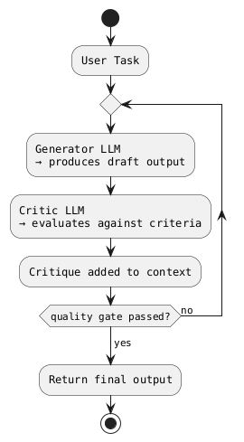

Variants:
- **Reflexion** — stores failed attempts in memory to avoid repeating mistakes
- **Constitutional AI** — critique against a fixed set of principles

---

### 5. Multi-Agent (Orchestrator + Subagents)

One orchestrator decomposes a task and delegates to specialist subagents.
Subagents can run in parallel.

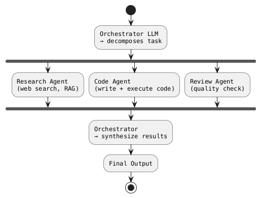

---

### 6. Tree of Thoughts (ToT)

Extends chain-of-thought by exploring a **tree** of reasoning paths. The model evaluates
intermediate steps and prunes dead branches (BFS or DFS).

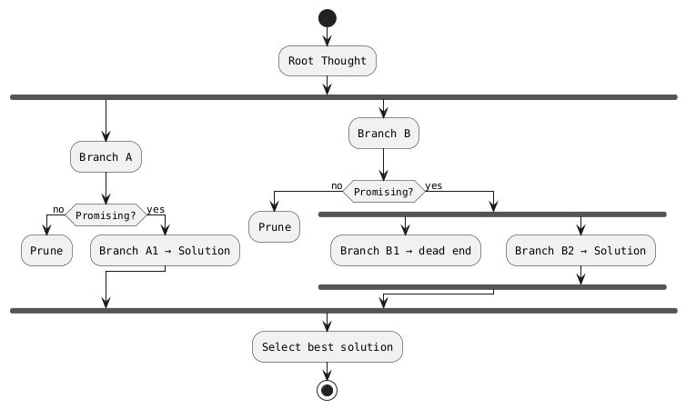

Best for combinatorial search problems: puzzles, theorem proving, multi-step math.

---

### 7. Memory-Augmented Agent

Any pattern above extended with explicit memory stores:

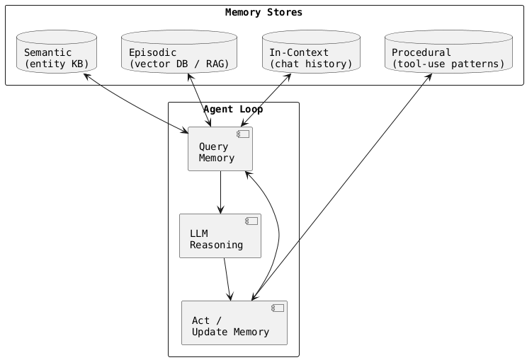

---

### 8. Event-Driven Agentic Loop

The agent is triggered by external events, not user input.
Runs autonomously, emits structured outputs to downstream systems.

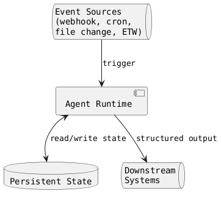

---

### Pattern Selection Heuristic

| Scenario                         | Best Pattern          |
|----------------------------------|-----------------------|
| Single-turn Q&A                  | REPL                  |
| Tool use, web search             | ReAct                 |
| Long multi-step task             | Plan-and-Execute      |
| Quality-sensitive generation     | Reflection            |
| Parallelizable subtasks          | Multi-Agent           |
| Search / optimization problems   | Tree of Thoughts      |
| Long-term recall across sessions | Memory-Augmented      |
| Persistent autonomous work       | Event-Driven          |

---

## Part 2 — LangGraph Patterns In Depth

LangGraph is built on one foundational abstraction — **stateful directed graphs** — and layers
several agent patterns on top of it.

### Core Abstraction — State Machine

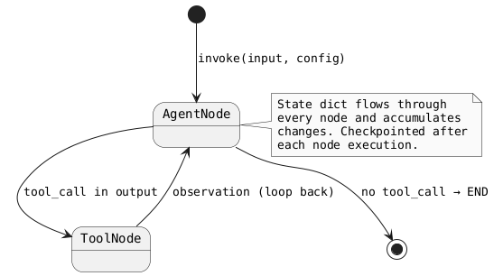

- **Nodes** = Python functions (LLM calls, tool calls, logic)
- **Edges** = transitions (fixed or conditional)
- **State** = typed dict that flows through every node
- Control flow lives in **your code**, not the LLM's output

---

### ReAct Loop via Graph Cycles

```python
graph.add_conditional_edges(
    "agent",
    should_continue,           # tool_call? → "tools" : END
    {"tools": "tools", END: END}
)
graph.add_edge("tools", "agent")   # loop back = ReAct cycle
```

---

### Human-in-the-Loop via Interrupt + Checkpointer

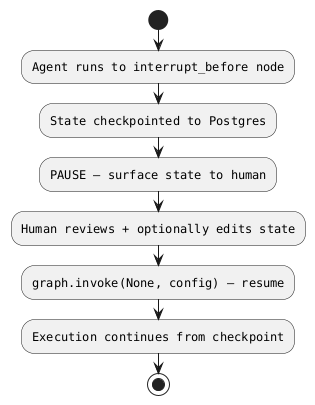

```python
graph = workflow.compile(
    checkpointer=checkpointer,
    interrupt_before=["approve_action"]
)
graph.update_state(config, {"approved": True})   # human edits state
graph.invoke(None, config)                        # resume
```

---

### Map-Reduce via Send API

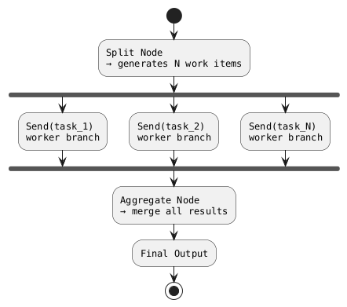

---

### LangGraph Pattern-to-Primitive Mapping

| LangGraph Primitive       | Agent Pattern Enabled               |
|---------------------------|-------------------------------------|
| Cycles                    | ReAct, Reflection                   |
| Conditional edges         | Plan-and-Execute, Supervisor        |
| Send API (parallel)       | Map-Reduce, Multi-Agent fan-out     |
| Interrupt + Checkpointer  | Human-in-the-Loop, Resume           |
| Subgraphs                 | Multi-Agent composition             |

---

## Part 3 — Framework Comparison: LangGraph vs AutoGen vs CrewAI

### Mental Model

| Framework  | Core Abstraction        | Mental Model                                   |
|------------|-------------------------|------------------------------------------------|
| LangGraph  | Stateful directed graph | You are the architect — explicit nodes, edges  |
| AutoGen    | Conversational agents   | Agents are actors that talk to each other      |
| CrewAI     | Role-based crew         | Agents are employees with job descriptions     |

---

### Control Flow Patterns

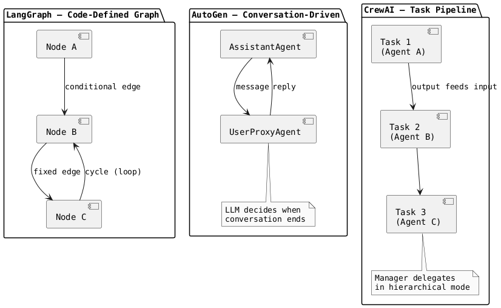

---

### Multi-Agent Topology Support

| Topology                  | LangGraph            | AutoGen                   | CrewAI                  |
|---------------------------|----------------------|---------------------------|-------------------------|
| Sequential pipeline       | Graph edges          | `initiate_chat` chain     | Sequential process      |
| Supervisor → workers      | Supervisor subgraph  | `GroupChat` with selector | Hierarchical process    |
| Peer-to-peer conversation | Manual graph cycle   | Native (core feature)     | Not native              |
| Parallel fan-out          | Send API             | Async agents              | Partial (async tasks)   |
| Nested subgraphs          | Native               | Nested `GroupChat`        | Nested crews (v0.8+)    |

AutoGen's **GroupChat** is its signature: N agents in a room, a selector picks who speaks next.

---

### State / Memory Model

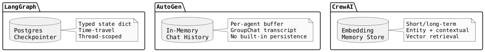

---

### Human-in-the-Loop

|                          | LangGraph                    | AutoGen                     | CrewAI       |
|--------------------------|------------------------------|-----------------------------|--------------|
| Interrupt before node    | Native (`interrupt_before`)  | `human_input_mode` on agent | Limited      |
| Approve tool call        | Native                       | `human_input_mode=ALWAYS`   | Not native   |
| Resume from checkpoint   | Native                       | Not built-in                | Not built-in |
| Edit state mid-run       | Native                       | Not built-in                | Not built-in |

---

### Determinism vs Emergence Spectrum

```plantuml
@startuml spectrum
skinparam monochrome true
skinparam defaultFontName Monospaced

left to right direction

rectangle "DETERMINISTIC" as D
rectangle "LangGraph\n(you define flow)" as LG
rectangle "CrewAI\n(task pipeline)" as CA
rectangle "AutoGen\n(emergent conversation)" as AU
rectangle "EMERGENT" as E

D --> LG
LG --> CA
CA --> AU
AU --> E

@enduml
```

---

### When to Use Which Framework

| Use Case                            | Best Fit   | Why                                           |
|-------------------------------------|------------|-----------------------------------------------|
| Production workflow with approvals  | LangGraph  | Checkpointing, interrupt, audit trail         |
| Data science / coding assistant     | AutoGen    | Native code execution sandbox                 |
| RAG pipeline, document processing   | LangGraph  | Map-reduce, parallel fan-out                  |
| Quick prototype multi-agent system  | CrewAI     | Minimal boilerplate, role-based intuition     |
| Research / experimental agents      | AutoGen    | Emergent conversation, flexible               |
| Long-running background automation  | LangGraph  | Persistent state, resume on failure           |
| Role-playing agent workflows        | CrewAI     | Task + role abstraction fits naturally        |
| Regulated / auditable systems       | LangGraph  | Only one with time-travel + state snapshots   |

---

## Part 4 — LangGraph State Persistence in Production

### Checkpoint Architecture

```plantuml
@startuml checkpoint_arch
skinparam monochrome true
skinparam defaultFontName Monospaced

actor "API Request" as REQ
component "LangGraph\nApp (stateless)" as APP
database "PostgreSQL\nCheckpoint Store" as PG

REQ --> APP : invoke(input, config{thread_id})
APP --> PG : write checkpoint after each node
APP <-- PG : read checkpoint on resume
REQ <-- APP : final output

note right of PG
  thread_id, checkpoint_id,
  parent_id, ts,
  channel_values (full state),
  metadata (step, writes)
end note

@enduml
```

The graph process is **stateless** — all state lives in the checkpoint store.
Horizontal scaling works; one thread_id processed by one instance at a time
(advisory locks).

---

### Checkpoint Backends

| Backend         | Use Case                  | Notes                          |
|-----------------|---------------------------|--------------------------------|
| `MemorySaver`   | Dev / testing only        | Lost on process restart        |
| `SqliteSaver`   | Single-process production | File-based, simple             |
| `PostgresSaver` | Multi-process production  | Recommended for scale          |
| `RedisSaver`    | High-throughput           | TTL support                    |
| Custom          | Any store                 | Implement `BaseCheckpointSaver`|

---

### Resume After Failure

```plantuml
@startuml resume
skinparam monochrome true
skinparam defaultFontName Monospaced

start
:invoke(input, thread_id="job-99");
:Node A executes → checkpoint saved;
:Node B executes → checkpoint saved;
:Node C crashes → EXCEPTION;
note right : Last checkpoint = end of Node B

:... time passes, process restarts ...;

:invoke(None, thread_id="job-99");
note right : input=None signals resume
:Load checkpoint — skip A, B (already done);
:Re-execute Node C from saved state;
:Continue D, E → complete;
stop

@enduml
```

---

### Time-Travel / Branching

```plantuml
@startuml time_travel
skinparam monochrome true
skinparam defaultFontName Monospaced

left to right direction

rectangle "Original Run" {
  (CP-1) --> (CP-2) --> (CP-3) --> (CP-4) --> (CP-5)
}

rectangle "Fork from CP-3" {
  (CP-3-fork) --> (CP-4') --> (CP-5')
  note bottom : Different state injected\nat CP-3, diverges forward
}

(CP-3) ..> (CP-3-fork) : update_state()\ncreates fork

@enduml
```

Use cases: debug production failures, A/B test agent decisions, recover from bad decisions.

---

### Production Gotchas

| Gotcha               | Detail                                                                 |
|----------------------|------------------------------------------------------------------------|
| State size bloat     | Store S3 keys / DB IDs in state, not raw document content             |
| Serialization        | Everything in state must be JSON-serializable; Pydantic models work    |
| Thread ID design     | Use domain IDs (`order-123`) not random UUIDs for external lookups    |
| Checkpoint retention | Checkpoints accumulate forever — add TTL policy or cleanup job        |
| Idempotency          | Re-run nodes must be idempotent; check state before acting            |

---

## Part 5 — Patterns in Practice: Your Projects

### Project Pattern Map

```plantuml
@startuml project_map
skinparam monochrome true
skinparam defaultFontName Monospaced

package "Raw Claude API" {
  component "ai-kb-quiz\n(RAG + Hybrid Routing + REPL)" as KBQ
  component "ai-kd\n(ReAct Tool Calling)" as KD
}

package "LangGraph + Pydantic AI" {
  component "ai-threat-state-graph\n(Stateful Detection Graph)" as TSG
}

package "MCP Server" {
  component "ai-procwatch-mcp\n(Tool Registry + Two-Tier Triage)" as PWM
}

package "Deterministic (No LLM)" {
  component "ai-asset-sweeper\n(Lua DSL Scripting)" as ASW
}

package "Design Phase" {
  component "vigil-ai\n(Service + Sidecar)" as VIG
}

@enduml
```

---

### ai-kb-quiz — Hybrid Routing + PTC + RAG

**Patterns:** Hybrid model routing, Process-Then-Communicate (PTC), Vectorized RAG, Interactive
REPL learning loop.

```plantuml
@startuml kb_quiz
skinparam monochrome true
skinparam defaultFontName Monospaced

start
:Markdown KB files;
:Chunker\n(bold-header + paragraph split, 300-600 chars);
:SHA-256 dedup → Context Cache;
:Embedder\n(Ollama nomic-embed-text or sentence-transformers);
:ChromaDB Vector Store;

note right : Indexing path (offline)

:User query;
:Retriever → top-k chunks;
:PTC Compression\n(compress context before model call — never raw KB text);
:Router\n(complexity → local Ollama OR premium Claude);
fork
  :LocalAdapter\n(Ollama qwen/llama);
fork again
  :PremiumAdapter\n(Claude Sonnet);
end fork
:Scorer + follow-up suggestions;
:Interactive REPL loop;
stop

@enduml
```

**Key insight:** The **PTC pattern** (Process-Then-Communicate) ensures raw KB content never hits
the model — it is compressed first. The router avoids premium API calls for simple questions.

---

### ai-kd — ReAct Tool Calling Loop (Kernel Debugger)

**Pattern:** ReAct with a single tool (`execute_windbg_action`), plus a sanitization layer that
strips kernel addresses before sending output to Claude.

```plantuml
@startuml ai_kd
skinparam monochrome true
skinparam defaultFontName Monospaced

start
:Debug session starts\n(CdbSession CLI or pykd WinDbg);
:Initial context sent to Claude Sonnet;

repeat
  :Claude: Thought + Action\n(select WinDbg command);
  :Sanitiser strips kernel addresses\nfrom proposed command;
  :execute_windbg_action\n(run in CdbSession/pykd);
  :Sanitiser strips addresses from output;
  :Observation returned to Claude;
repeat while (root cause found OR max 25 iterations?) is (no)
->yes;

:AnalysisResult\n(root-cause text + tool_call_log);
stop

@enduml
```

**Key insight:** The sanitization layer is a **security boundary** — it prevents prompt injection
via malicious kernel output and avoids leaking KASLR addresses to the external API.

---

### ai-threat-state-graph — CAAD Loop + Five Detection Engines

**Pattern:** Stateful LangGraph graph with CAAD loop (Collect → Analyze → Act → Decide).
Deterministic detection engines in Phase 1; Claude escalation added off critical path in Phase 2.

```plantuml
@startuml threat_state
skinparam monochrome true
skinparam defaultFontName Monospaced

start
:edr-sensor.sys\n(Ring 0: callbacks → lock-free MPSC ring buffer);
:edr-service.exe\n(IOCP Proactor, IRP bridge);

:ThreatContext created\n(events, evidence, tactics, confidence);

repeat
  :COLLECT\n→ gather more telemetry if needed;
  :ANALYZE\nYARA-X | Sigma | Lua | PowerShell | Python;

  note right
    Five engines run in parallel:
    YARA-X  → file/memory content
    Sigma   → event log correlation
    Lua     → behavioral scripts
    PS      → host-state queries
    Python  → multi-event correlation
  end note

  :ACT\n→ generate verdict candidate;
  :DECIDE\n→ confidence threshold check;
repeat while (confidence < threshold AND iterations < 8) is (yes)
->no;

if (Phase 2 LLM escalation?) then (yes)
  :Claude Sonnet\n→ off critical path, advisory only;
endif

:Verdict\n(classification, confidence, MITRE, IOCs, YARA matches);
stop

@enduml
```

**Key insight:** LLM is **never on the critical detection path** — the CAAD loop uses deterministic
engines. Claude is an escalation-only advisory in Phase 2. This is the correct architecture for
security-critical systems where latency and reliability matter.

---

### ai-procwatch-mcp — MCP Tool Registry + Two-Tier Triage

**Pattern:** MCP server exposing 8 tools; behavioral genome tracked via ETW + eBPF; two-tier LLM
classification (local Ollama triage → Claude escalation on high-confidence anomalies).

```plantuml
@startuml procwatch
skinparam monochrome true
skinparam defaultFontName Monospaced

start

fork
  :KrabsETW\n(Process, File, Network,\nRegistry, VirtualAlloc);
fork again
  :Windows eBPF\n(socket bind/connect,\nDKOM-hidden process detection);
fork again
  :NTFS USN Journal\n(file create/rename/delete);
end fork

:OCSF 1.5 + STIX 2.1 Normalization;
:Behavioral Genome\n(sqlite-vec RAG store);

:MCP Tool Registry\n(start/stop/query/classify_genome, etc.);

:Tier 1: Ollama triage\n(qwen3:4b — fast, local);

if (High-confidence anomaly?) then (yes)
  :Tier 2: Claude escalation\n(chunked genome submission);
endif

:Verdict JSON\n(verdict, score, confidence,\nMITRE techniques, reasons);
stop

@enduml
```

**Key insight:** The **two-tier triage** pattern keeps most inference local (low cost, low latency)
and escalates to a premium model only when the local model flags high confidence. Server-initiated
sampling means escalation happens mid-capture without waiting for the user.

---

### ai-asset-sweeper — Sandboxed Lua DSL (No LLM)

**Pattern:** No LLM. Detection logic lives in Lua scripts; C++ orchestrator runs them in a
sandboxed `lua_State` with whitelisted functions only.

```plantuml
@startuml asset_sweeper
skinparam monochrome true
skinparam defaultFontName Monospaced

start
:Orchestrator discovers *.lua detector scripts;

repeat
  :LuaEngine — load script into sandboxed lua_State\n(remove os.execute, io.popen, etc.);

  fork
    :probe.registry;
  fork again
    :probe.filesystem;
  fork again
    :probe.credentials;
  fork again
    :probe.modelheader;
  fork again
    :probe.process;
  end fork

  :Accumulate findings\n(asset_type, severity, location);
repeat while (more scripts?) is (yes)
->no;

:Reporter\n(Text / JSON / CSV);
stop

@enduml
```

**Key insight:** Lua scripts run hot-reloadable without recompiling the C++ host. The sandbox
removes dangerous standard library functions — this is the **Error Kernel** principle applied:
isolate the part that touches untrusted input (detector scripts) from the part that must not fail
(the C++ host).

---

### Pattern Summary Across Projects

| Project               | Framework          | Core Pattern          | LLM Role                        |
|-----------------------|--------------------|-----------------------|---------------------------------|
| ai-kb-quiz            | Raw Claude API     | RAG + Hybrid Routing  | Primary reasoning engine        |
| ai-kd                 | Raw Claude API     | ReAct (tool calling)  | Primary reasoning engine        |
| ai-threat-state-graph | LangGraph + Pydantic AI | CAAD stateful loop | Advisory escalation (Phase 2)   |
| ai-procwatch-mcp      | MCP Server         | Two-tier triage       | Tier 2 escalation only          |
| ai-asset-sweeper      | None (Lua DSL)     | Sandboxed scripting   | None (fully deterministic)      |
| vigil-ai              | Design only        | Service + sidecar     | Local Phi-4 Mini (planned)      |

---

## Part 6 — Quick Reference

### All Patterns at a Glance

| Pattern            | Control Flow     | Memory          | Best For                        |
|--------------------|------------------|-----------------|---------------------------------|
| REPL               | None             | None            | Simple chatbot                  |
| ReAct              | LLM-driven loop  | In-context      | Tool use, search                |
| Plan-and-Execute   | Planner LLM      | State dict      | Long-horizon tasks              |
| Reflection         | Quality gate     | In-context      | Quality-sensitive generation    |
| Multi-Agent        | Orchestrator     | Shared state    | Parallelizable subtasks         |
| Tree of Thoughts   | BFS/DFS search   | In-context      | Optimization, proofs            |
| Memory-Augmented   | Any              | Vector DB / KB  | Long-term recall                |
| Event-Driven       | External event   | Persistent      | Background automation           |
| LangGraph Graph    | Code-defined     | Checkpointer    | Production workflows            |
| AutoGen GroupChat  | Emergent conv.   | Chat history    | Coding agents, research         |
| CrewAI Process     | Task pipeline    | Embedding store | Role-based workflows            |

### The Key Architectural Principle

> **LLM on the critical path = latency + reliability risk.**
> Keep LLMs advisory or escalation-only for safety-critical, latency-sensitive, or
> regulated systems. Use deterministic engines as the primary layer; bring the LLM in
> only when confidence is low or human escalation is warranted.

This principle appears in ai-threat-state-graph (CAAD loop, LLM off critical path) and
ai-procwatch-mcp (two-tier triage, Ollama first, Claude escalation only).
