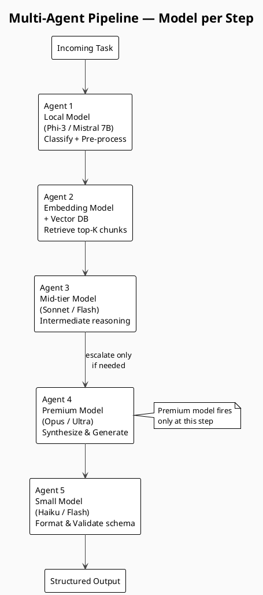
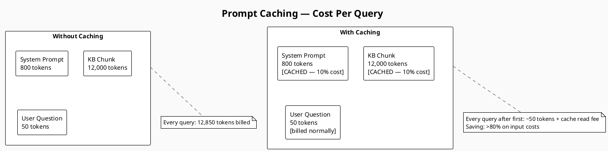
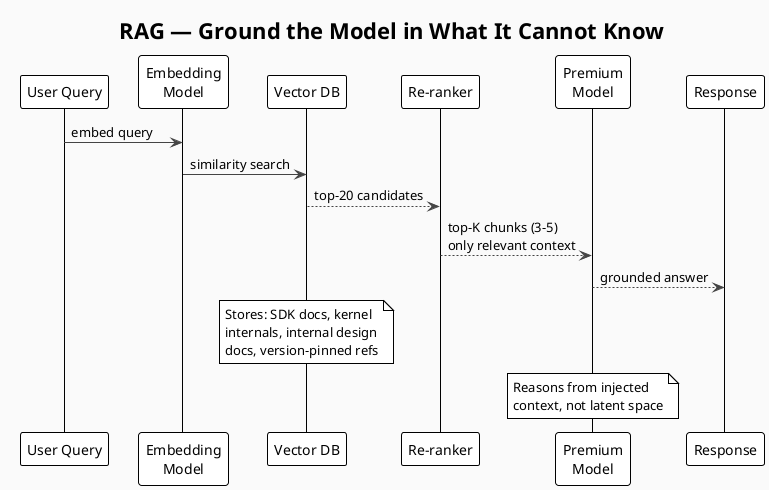
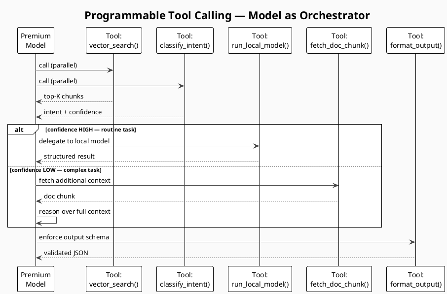
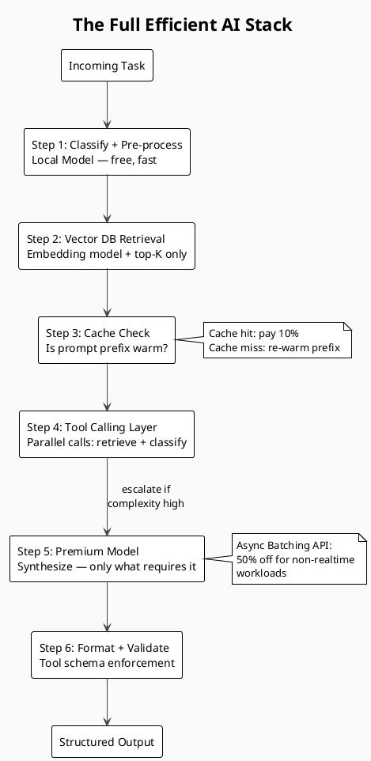

# Stop Burning Your AI Budget

> An Engineer's Guide to Efficient Premium Model Usage

The debate is everywhere in enterprise right now: are we getting productivity returns that
justify the token costs? Finance wants invoices justified. Engineering wants fewer restrictions
on model access. Leadership wants both.

I'm an enterprise software engineer who also runs personal AI projects on my own Claude and
Gemini subscriptions — a knowledge distillation pipeline, a KB quiz engine, and a
process-monitoring MCP server. That combination gives me a useful vantage point: I feel the
cost personally, I see the productivity question professionally, and I've had to find real
answers for both. Here's what I've learned.

---

## The Core Mental Model: Route by Difficulty

Stop treating your AI stack as a single model and start treating it as a **fleet with a
routing layer**. Premium models (Claude Opus, Gemini Ultra) are best for complex multi-step
reasoning, novel synthesis across sources, and high-stakes output where quality directly
affects users. Everything else is a candidate for a cheaper or local alternative.

---

## 1. Multi-Agent Pipelines — Match the Model to the Step

Most workflows aren't a single task — they're a sequence of steps with very different
complexity profiles. Assigning one premium model to the entire pipeline is like hiring a
specialist surgeon to also do your hospital's paperwork. The better approach: decompose your
workflow into steps, then assign the **cheapest model capable of each step**.



Example — a document Q&A skill:

```
Step 1: Parse & clean raw input          → local model (Phi-3, Mistral 7B)
Step 2: Classify intent / route query    → small cloud model (Haiku, Flash)
Step 3: Retrieve relevant chunks (RAG)   → embedding model only, no LLM
Step 4: Synthesize answer from chunks    → premium model (Claude Sonnet/Opus)
Step 5: Format & validate output schema  → small cloud model (Haiku, Flash)
```

Practical implementation tips:

- **Schema contracts:** Define a schema contract between agents — the output of each step is
  the structured input to the next.
- **Single responsibility:** Each agent should have a single responsibility. Agents that do
  too much become expensive and opaque.
- **Confidence scoring:** Build confidence scoring into classification steps — if the cheaper
  model isn't confident, escalate.
- **MCP integration:** With MCP support, wire different model-backed agents as distinct MCP
  servers, each domain-specialized.

---

## 2. Prompt / Token Caching — The Fastest Win

Claude's prompt caching lets you cache a prefix of your context (system prompt, documents,
examples) and pay approximately **10% of the input token cost** on repeated calls that share
that prefix.



Rules for getting cache hits:

- Put **stable content first** (system prompt, docs, few-shot examples).
- Put **variable content last** (the user's actual question).
- Use consistent `cache_control` breakpoints across requests in the same session.
- Cache TTL is **5 minutes** on Anthropic's API — keep call cadence inside that window or
  re-warm explicitly.

In one of my personal projects — a knowledge base quiz engine that repeatedly queries the same
document corpus — this single change reduced input token costs by **over 80%**.

---

## 3. Vector DBs — Ground the Model in What It Cannot Know

Before getting to the cost angle, it's worth understanding why a vector database is necessary
in the first place. Large language models reason from their latent space — knowledge compressed
into weights during training. That works well for general concepts, but it fails in predictable
ways:

- **Version-specific SDK and API references:** The model was trained on docs from months ago.
  It will confidently describe a method signature that no longer exists.
- **Deep domain knowledge:** Windows kernel internals, IRQL rules, minifilter callback
  contracts. Models have surface-level familiarity, not the precision required when the details
  actually matter.
- **Internal project context:** Your component design, your team's architectural decisions,
  your internal APIs. The model has zero knowledge of these by definition.

The fix is **RAG** — injecting authoritative, current context into the prompt so the model
reasons from your ground truth rather than its best guess.



Sizing guidance:

- **Top-K = 3–5 chunks** is usually enough. More is rarely better and always more expensive.
- **Chunk size:** 512–1024 tokens per chunk gives retrieval precision without truncating context.
- **Re-rank before sending:** use a lightweight cross-encoder or BM25 hybrid.

> Key reframe: RAG isn't primarily a cost optimization — it's a **correctness optimization**
> that also happens to reduce cost. That's a much easier sell in an enterprise conversation
> where accuracy matters more than invoices.

---

## 4. Local Models — Free the Routine Work

Not every task needs a frontier model. Local models (Ollama + Llama 3, Mistral, Phi-3)
running on your own hardware handle a surprising amount of routine work.

| Task                                        | Use Local | Use Premium |
|---------------------------------------------|:---------:|:-----------:|
| Intent classification                       | ✓         |             |
| Entity extraction (structured schema)       | ✓         |             |
| Routing / triage                            | ✓         |             |
| Summarization of well-structured input      | ✓         |             |
| Complex reasoning across multiple documents |           | ✓           |
| Code generation with non-trivial logic      |           | ✓           |
| Novel synthesis, edge cases, ambiguity      |           | ✓           |

My personal knowledge distillation pipeline uses a local 7B model to pre-process and structure
raw input, then sends only the structured output to Claude for synthesis. Token input to Claude
drops **60–70%** because the local model did the cleanup first.

---

## 5. Context Window Discipline

Premium models have large context windows. That doesn't mean you should fill them. Cost scales
linearly with input tokens. Quality does not.

- **Compress before sending:** Summarize prior conversation turns rather than appending them
  verbatim.
- **Structured output contracts:** Ask the model to return JSON with a defined schema —
  smaller, parseable outputs, no rambling preambles.
- **Trim few-shot examples:** Three high-quality examples beat ten mediocre ones — and cost
  70% less.
- **Strip metadata:** Remove headers, footers, page numbers, and formatting artifacts from
  documents before sending.

---

## 6. Programmable Tool Calling — The Model as Orchestrator

Tool calling (function calling) is commonly seen as a way to connect models to external data.
Its bigger value is architectural: it lets the premium model act as an **orchestrator** that
decides what to invoke — and what not to invoke — rather than doing all reasoning inline.

Three efficiency patterns emerge from this:

- **Parallel tool calls reduce round trips:** The model can call `vector_search()` and
  `classify_intent()` in a single response. Instead of two sequential round trips — each
  paying full input token cost — you get one. For pipelines with multiple retrieval steps
  this compounds quickly.
- **Tools as cheap-service wrappers:** Define tools that wrap your local model, embedding
  service, or cache lookup. The premium model decides whether to invoke them based on the
  task. A high-confidence classification routes to `run_local_model()`; a complex synthesis
  stays in-model. The model becomes the router — no separate routing layer needed.
- **Schema enforcement via tool definitions:** Instead of prompt-engineering "return valid
  JSON with fields X, Y, Z" and then parsing brittle free text, define a tool with a strict
  JSON schema. The model is constrained to call it correctly. Output token count drops,
  parsing reliability goes to near-100%, and you eliminate a whole class of retry logic.



Practical tips:

- Keep tool descriptions concise — they count against your input tokens on every call.
- Group tools logically: retrieval tools, transformation tools, output tools. Fewer tools in
  scope = less decision overhead for the model.
- Use `tool_choice: "required"` when you always need structured output — prevents the model
  from answering in prose instead.
- Log every tool invocation with latency and token counts. This is where you find the
  expensive surprises.

---

## 7. Async Batching — Don't Pay Rush Rates for Batch Work

Anthropic's Message Batches API gives you **50% off** input and output tokens for non-real-time
workloads with 24-hour turnaround. Nightly evaluations, bulk document processing, quiz
generation pipelines — none of these should hit the synchronous API. Same principle applies
across providers: identify workloads that can tolerate latency and route them to batch
endpoints.

---

## The Full Stack

Each layer below reduces what reaches the premium model. The premium model does what only it
can do — and nothing else.



---

## Answering the Enterprise Debate

When the cost-vs-productivity question comes up at work, the honest answer is: the question is
usually posed too broadly to be useful. It's not "is Claude worth it?" — it's "which steps in
our workflows justify the cost, and which are we routing there out of habit?"

Track these metrics per feature:

- **Input tokens per task** — primary cost driver
- **Cache hit rate** — target >70% for KB-heavy workloads
- **Local/mid-tier deflection rate** — % of steps resolved without a premium call
- **Premium model invocation rate** — how often does the expensive agent actually fire?
- **Output token ratio** — output/input; high ratios mean you're extracting value

---

## The Mindset Shift

Premium models are exceptional tools. Routing every step of every workflow through them is like
staffing a team entirely with principal engineers when juniors, mids, and seniors each have work
suited to their level.

The engineers extracting real value from frontier AI are the ones who build agent pipelines with
**deliberate model assignment** — so that when the premium model runs, it runs on exactly the
right input, at exactly the right step, at exactly the right time.

**Build the infrastructure. Make every premium token count.**
